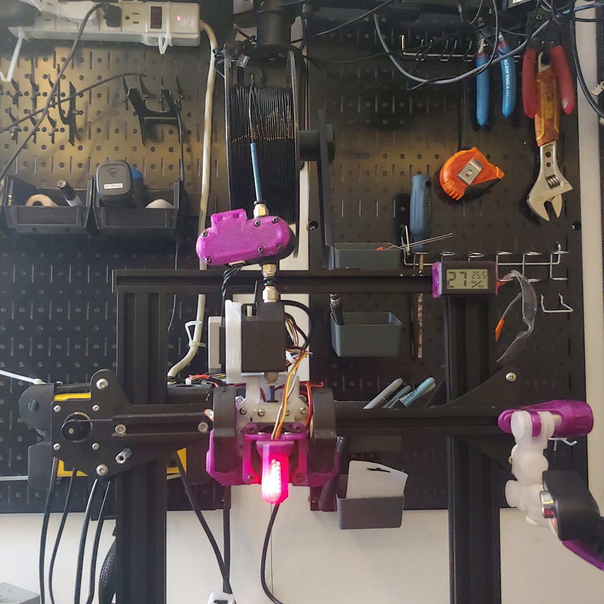
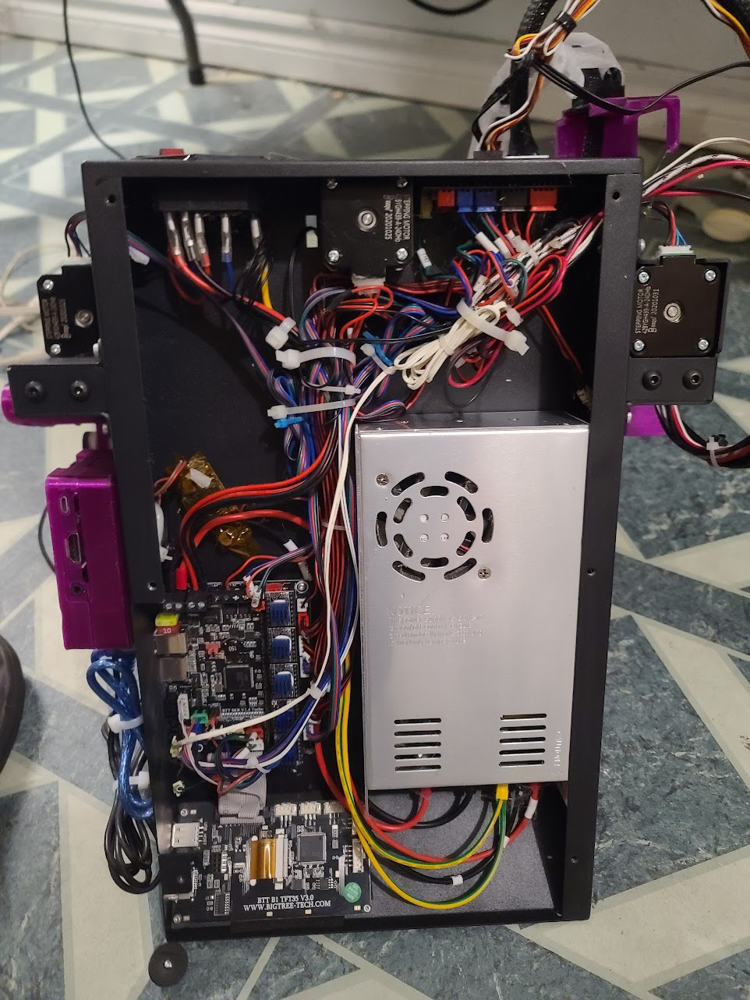
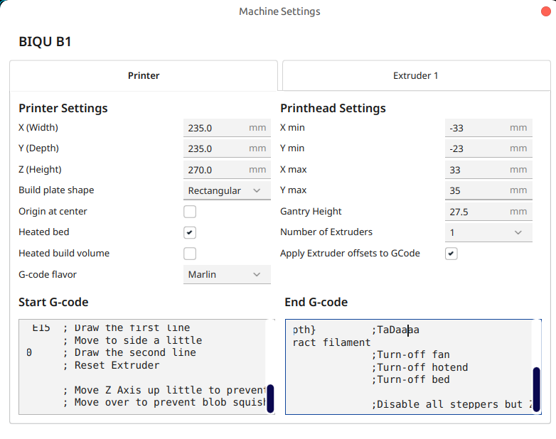

# 3DPrinter_purpleStarfish
A complete reengineering of the BigTreeTech BIQU B1. Designed for larger nozzle(0.6mm) and exotic filaments 






## Start G-Code

```
; BIQU B1 Start G-code
M117 Getting the bed up to temp!
M140 S{material_bed_temperature_layer_0}      ; Set Heat Bed temperature
M104 S170; Set Extruder temp to 170
M190 S{material_bed_temperature_layer_0}      ; Wait for Heat Bed temperature
M117 Getting the extruder up to temp!
;M104 S{material_print_temperature_layer_0}    ; Set Extruder temperature
G92 E0                           ; Reset Extruder
M117 Homing axes
G34                              ; Home all axes
G29;
;Moved to after purging;M109 S{material_print_temperature_layer_0}    ; Wait for Extruder temperature
G1 Z2.0 F3000                    ; Move Z Axis up little to prevent scratching of Heat Bed
G1 X4.1 Y20 Z0.3 F5000.0         ; Move to start position
M104 S{material_print_temperature_layer_0}
M109 S{material_print_temperature_layer_0}
M117 Purging
G1 X7.1 Y200.0 Z0.3 F1500.0 E15  ; Draw the first line
G1 X7.4 Y200.0 Z0.3 F5000.0      ; Move to side a little
G1 X7.4 Y20 Z0.3 F1500.0 E30     ; Draw the second line
G92 E0                           ; Reset Extruder
M117 Lets make
G1 Z2.0 F3000                    ; Move Z Axis up little to prevent scratching of Heat Bed
G1 X5 Y20 Z0.3 F5000.0           ; Move over to prevent blob squish
```

## End G-Code

```
;BIQU Default End Gcode
G91                            ;Relative positioning
G1 E-2 F2700                   ;Retract a bit
G1 E-2 Z0.2 F2400              ;Retract a bit more and raise Z
G1 X5 Y5 F3000                 ;Wipe out
G1 Z10                         ;Raise Z by 10mm
G90                            ;Return to absolute positionning

G1 X0 Y{machine_depth}         ;TaDaaaa
;G1 E-5 F1200 ;Retract filament
M106 S0                        ;Turn-off fan
M104 S0                        ;Turn-off hotend
M140 S0                        ;Turn-off bed

M84 X Y E                      ;Disable all steppers but Z
```


